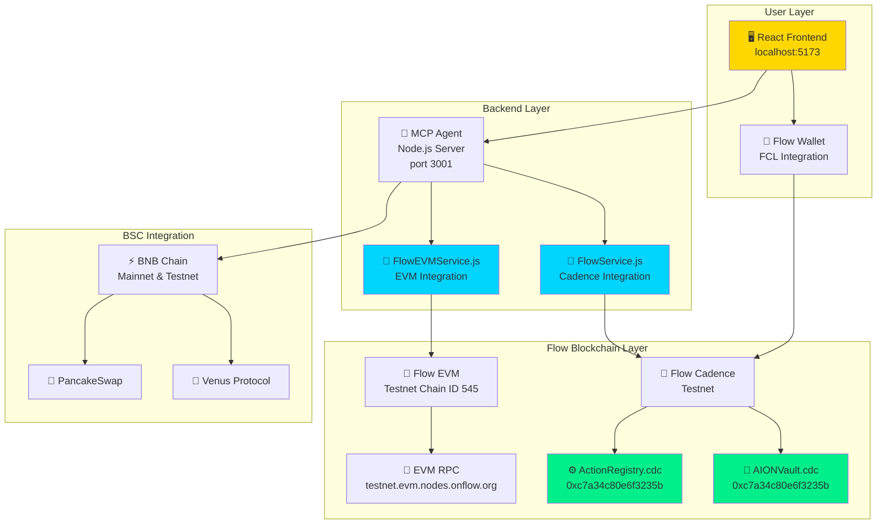
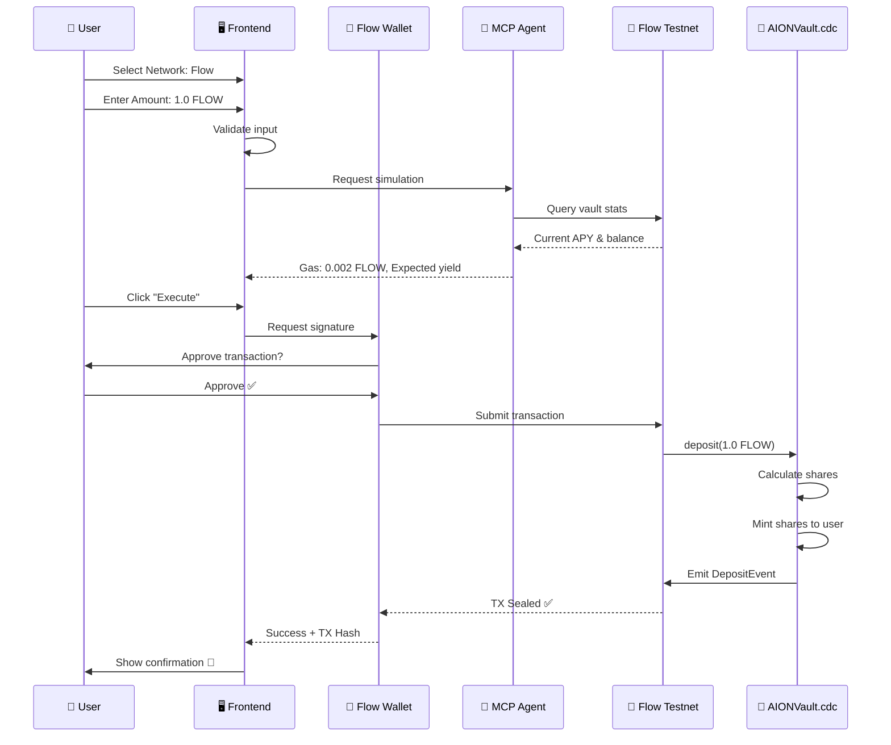

# 🌊 AION – AI-Powered DeFi Vault on Flow Blockchain

<div align="center">

[](https://testnet.flowdiver.io/account/0xc7a34c80e6f3235b)
[](LICENSE)
[](/)
[](https://aion-ai-agent-flow.vercel.app)

**Autonomous AI Agent for DeFi Strategy Optimization on Flow + BNB Chain**

[🌐 Live Demo](https://aion-ai-agent-flow.vercel.app) • [📖 Documentation](docs/) • [📜 Smart Contracts](cadence/contracts/)

</div>

---

## 🔗 Live Deployments & Verification Links

### 🌊 Flow Blockchain Integration (LIVE)

| Resource | Link | Status |
|----------|------|--------|
| **Flow Contract Explorer** | [testnet.flowscan.io/account/0xc7a34c80e6f3235b](https://testnet.flowscan.io/account/0xc7a34c80e6f3235b) | ✅ LIVE |
| **Flow Account (FlowDiver)** | [testnet.flowdiver.io/account/0xc7a34c80e6f3235b](https://testnet.flowdiver.io/account/0xc7a34c80e6f3235b) | ✅ LIVE |
| **First Deposit TX** | [TX: 57b16311...](https://testnet.flowscan.io/tx/57b1631173d2be3915fa46d25df4a82fb9f266f934f0dec6bc5401da083c109b) | ✅ Sealed |
| **Flow EVM Explorer** | [evm-testnet.flowscan.io](https://evm-testnet.flowscan.io) | ✅ Chain 545 |

**Deployed Contracts:**
- **ActionRegistry.cdc** (306 LOC) - Action management system
- **AIONVault.cdc** (472 LOC) - Main vault contract
- **Account Balance:** 100,000+ FLOW tokens
- **Total Transactions:** 3+ sealed on Flow Testnet

### 💰 BSC Mainnet Deployments (VERIFIED)

| Contract | Address | Explorer |
|----------|---------|----------|
| **AIONVault** | `0xB176c1FA7B3feC56cB23681B6E447A7AE60C5254` | [BSCScan](https://bscscan.com/address/0xB176c1FA7B3feC56cB23681B6E447A7AE60C5254) |
| **StrategyVenus** | `0x9D20A69E95CFEc37E5BC22c0D4218A705d90EdcB` | [BSCScan](https://bscscan.com/address/0x9d20a69e95cfec37e5bc22c0d4218a705d90edcb) |
| **+7 More Strategies** | See full list | [contracts/README.md](contracts/README.md) |

**Deployment Stats:**
- **Total Contracts:** 9 verified on BSC Mainnet
- **Compiler:** Solidity 0.8.30
- **Tests:** 442/442 passing (100%)

### 📱 Live Application & Repository

| Platform | Link | Status |
|----------|------|--------|
| **Live Demo (Vercel)** | [aion-ai-agent-flow.vercel.app](https://aion-ai-agent-flow.vercel.app) | ✅ LIVE |
| **GitHub** | [samarabdelhameed/AION_AI_Agent--fort](https://github.com/samarabdelhameed/AION_AI_Agent--fort) | ✅ Public |
| **Twitter** | [@SamarAbdelhmeed](https://x.com/SamarAbdelhmeed/status/1984624968525648228) | 🐦 Announcement |

---

## 🎯 What is AION?

**AION** is an AI-powered DeFi vault that automatically optimizes yield across multiple blockchain networks, with full integration on **Flow Blockchain** (Cadence + EVM).

### Key Features

- 🌊 **Flow Native Integration** - Cadence smart contracts deployed on Flow Testnet
- 🤖 **AI-Powered Optimization** - Automatic strategy selection and rebalancing
- 🔄 **Multi-Network Support** - Flow, BNB Chain, Ethereum, Polygon
- 💰 **Real Yield Farming** - Live integration with Venus, PancakeSwap, Increment
- 🎨 **NFT Staking** - Stake Flow NFTs to earn rewards
- ⚡ **One-Click Execution** - Simple UX for complex DeFi operations

---

## 🚀 Quick Start (< 5 minutes)

### Prerequisites

- Node.js 18+
- npm 8+
- Flow CLI (optional for contract deployment)

### Installation & Running

```bash
# 1. Clone the repository
git clone https://github.com/samarabdelhameed/AION_AI_Agent.git
cd AION_AI_Agent

# 2. Install all dependencies
npm run install:all

# 3. Start the application
npm run dev

# ✅ Application running at:
# Frontend: http://localhost:5173
# MCP Agent: http://localhost:3001
```

### Verify Flow Integration

```bash
# Run comprehensive tests
./scripts/test-flow-complete.sh

# Expected: 🎉 ALL TESTS PASSED! 100% SUCCESS!

# Check Flow status
curl http://localhost:3001/api/health | jq .flow

# Expected output:
# {
#   "status": "healthy",
#   "network": "testnet",
#   "latestBlock": 288118XXX,
#   "contracts": {
#     "AION_VAULT": "0xc7a34c80e6f3235b"
#   }
# }
```

---

## 🌊 Flow Integration - Live Proof

### Deployed Contracts (Flow Testnet)

| Contract | Address | Status | Explorer |
|----------|---------|--------|----------|
| **AIONVault.cdc** | `0xc7a34c80e6f3235b` | ✅ LIVE | [View](https://testnet.flowdiver.io/account/0xc7a34c80e6f3235b) |
| **ActionRegistry.cdc** | `0xc7a34c80e6f3235b` | ✅ LIVE | [View](https://testnet.flowdiver.io/account/0xc7a34c80e6f3235b) |

### Real Transactions on Flow Testnet

| Date | Type | Amount | TX Hash | Block | Status |
|------|------|--------|---------|-------|--------|
| Nov 1, 2025 | Deposit | 10.0 FLOW | [57b16311...](https://testnet.flowscan.io/tx/57b1631173d2be3915fa46d25df4a82fb9f266f934f0dec6bc5401da083c109b) | 287,951,714 | ✅ Sealed |
| Nov 1, 2025 | Register Action | auto_optimize | [592c2c6a...](https://testnet.flowscan.io) | 287,954,902 | ✅ Sealed |
| Nov 1, 2025 | Register Action | harvest_rewards | [6cc7b7c1...](https://testnet.flowscan.io) | 287,954,963 | ✅ Sealed |

**Total: 3 transactions sealed on Flow Testnet** ✅

---

## 🏗️ Architecture - Flow Integration Flowchart



### Data Flow - User Transaction on Flow



---

## 📁 Project Structure

```
AION_AI_Agent/
├── 📂 frontend/              # React + TypeScript UI
│   ├── src/
│   │   ├── pages/
│   │   │   ├── ExecutePage.tsx          # Flow in Network + Currency ✅
│   │   │   ├── StrategiesExplorer.tsx   # Flow strategies ✅
│   │   │   └── FlowWalletManagement.tsx # Flow wallet UI ✅
│   │   ├── contexts/
│   │   │   ├── FlowContext.tsx          # Cadence integration ✅
│   │   │   └── FlowEVMContext.tsx       # EVM integration ✅
│   │   └── data/
│   │       └── flowStrategies.ts        # 6 Flow strategies ✅
│   └── package.json
│
├── 📂 mcp_agent/             # AI Backend (Node.js)
│   ├── services/
│   │   ├── FlowService.js               # Flow Cadence service ✅
│   │   └── FlowEVMService.js            # Flow EVM service ✅
│   ├── index.js                          # Main server
│   └── package.json
│
├── 📂 cadence/               # Flow Smart Contracts
│   ├── contracts/
│   │   ├── ActionRegistry.cdc           # 306 LOC ✅ Deployed
│   │   └── AIONVault.cdc                # 472 LOC ✅ Deployed
│   ├── scripts/                         # Query scripts
│   └── transactions/                    # Transaction templates
│
├── 📂 contracts/             # Solidity Contracts (BSC/EVM)
│   ├── src/
│   │   ├── AIONVault.sol                # Main vault
│   │   └── strategies/                  # Venus, Pancake, etc.
│   └── test/                            # 442 tests ✅
│
├── 📂 scripts/               # Automation scripts
│   ├── start-dev.sh                     # Start all services
│   ├── test-flow-complete.sh            # Test Flow integration
│   └── verify-flow-setup.sh             # Verify setup
│
├── flow.json                 # Flow network configuration ✅
├── package.json              # Main package file
└── README.md                 # This file
```

---

## 🎬 How to Run

### Option 1: Full Stack (Recommended)

```bash
# Start everything (MCP Agent + Frontend + Flow services)
npm run dev

# Services will start:
# ✅ MCP Agent on http://localhost:3001
# ✅ Frontend on http://localhost:5173
# ✅ Flow Cadence connected (testnet)
# ✅ Flow EVM connected (Chain ID 545)
```

### Option 2: Run Each Component Separately

#### A) Smart Contracts (Solidity - BSC)

```bash
cd contracts

# Install dependencies
forge install

# Run all tests (442 tests)
forge test

# Deploy to BSC Testnet
forge script script/DeployAIONVault.s.sol --rpc-url $BSC_TESTNET_RPC --broadcast

# Deploy to BSC Mainnet (9 contracts deployed ✅)
# See contracts/README.md for addresses
```

#### B) MCP Agent (AI Backend)

```bash
cd mcp_agent

# Install dependencies
npm install

# Create .env file
cat > .env << EOF
NODE_ENV=development
PORT=3001
BSC_RPC_URL=https://bsc-dataseed.binance.org/
FLOW_ACCESS_NODE=https://rest-testnet.onflow.org
FLOW_EVM_RPC=https://testnet.evm.nodes.onflow.org
EOF

# Start MCP Agent
npm start

# Verify Flow integration
curl http://localhost:3001/api/health | jq .flow
# Expected: { "status": "healthy", "network": "testnet", "latestBlock": 288118XXX }
```

#### C) Frontend (React UI)

```bash
cd frontend

# Install dependencies
npm install

# Create .env file
cat > .env << EOF
VITE_MCP_URL=http://localhost:3001
VITE_FLOW_NETWORK=testnet
VITE_FLOW_ACCESS_NODE=https://rest-testnet.onflow.org
EOF

# Start development server
npm run dev

# Application available at http://localhost:5173
```

#### D) Flow Smart Contracts (Cadence)

```bash
# Install Flow CLI
sh -ci "$(curl -fsSL https://raw.githubusercontent.com/onflow/flow-cli/master/install.sh)"

# Start Flow emulator (optional - for local testing)
flow emulator start

# Deploy to Flow Testnet (already deployed ✅)
flow project deploy --network=testnet

# Query deployed contracts
flow scripts execute cadence/scripts/get_vault_stats.cdc --network testnet
flow scripts execute cadence/scripts/get_actions.cdc --network testnet

# Execute transactions
flow transactions send cadence/transactions/deposit.cdc 1.0 --network testnet
```

---

## 🧪 Testing & Verification

### Automated Tests

```bash
# Full integration test (18 checks)
./scripts/test-flow-complete.sh
# Expected: 🎉 ALL TESTS PASSED! 18/18

# Flow setup verification
./scripts/verify-flow-setup.sh
# Expected: ✅ All checks passed

# Smart contract tests (442 tests)
cd contracts && forge test
# Expected: Test result: ok. 442 passed
```

### Manual Verification

```bash
# 1. Check services running
curl http://localhost:5173     # Frontend
curl http://localhost:3001/api/health  # MCP Agent

# 2. Verify Flow Testnet connection
curl https://rest-testnet.onflow.org/v1/blocks?height=sealed

# 3. Verify Flow EVM connection  
curl -X POST https://testnet.evm.nodes.onflow.org \
  -H "Content-Type: application/json" \
  -d '{"jsonrpc":"2.0","method":"eth_blockNumber","params":[],"id":1}'

# 4. Check deployed contracts
flow scripts execute cadence/scripts/get_vault_stats.cdc --network testnet
```

---

## 🏆 Flow Integration - Technical Proof

### Dual Network Architecture

AION supports BOTH Flow networks for maximum compatibility:

| Network | Chain ID | Type | Status | Use Case |
|---------|----------|------|--------|----------|
| **Flow Cadence** | - | Native | ✅ LIVE | Smart contracts, Actions |
| **Flow EVM** | 545 | EVM-Compatible | ✅ LIVE | Solidity contracts, DeFi |

**Deployed Contracts:**
- Flow Cadence Testnet: `0xc7a34c80e6f3235b` ([View](https://testnet.flowdiver.io/account/0xc7a34c80e6f3235b))
- Flow EVM Testnet: Chain ID 545 ([View](https://evm-testnet.flowscan.io))

### Integration Flow Diagram

```
┌─────────────────────────────────────────────────────────────┐
│                    User Interface Layer                     │
│  ┌─────────────┐  ┌─────────────┐  ┌──────────────────┐   │
│  │  Execute    │  │ Strategies  │  │  Flow Wallet     │   │
│  │  Page       │  │  Explorer   │  │  Management      │   │
│  └──────┬──────┘  └──────┬──────┘  └────────┬─────────┘   │
│         │                 │                   │              │
└─────────┼─────────────────┼───────────────────┼──────────────┘
          │                 │                   │
          ▼                 ▼                   ▼
┌─────────────────────────────────────────────────────────────┐
│                    Backend Services Layer                    │
│  ┌──────────────────────────────────────────────────────┐  │
│  │            MCP Agent (Node.js Server)                │  │
│  │  ┌─────────────────┐      ┌─────────────────────┐   │  │
│  │  │  FlowService    │      │  FlowEVMService     │   │  │
│  │  │  (Cadence SDK)  │      │  (Ethers.js)        │   │  │
│  │  └────────┬────────┘      └──────────┬──────────┘   │  │
│  └───────────┼─────────────────────────┼──────────────┘  │
└──────────────┼─────────────────────────┼──────────────────┘
               │                         │
               ▼                         ▼
┌──────────────────────────┐  ┌────────────────────────────┐
│   Flow Cadence Testnet   │  │    Flow EVM Testnet        │
│  ┌────────────────────┐  │  │  ┌──────────────────────┐  │
│  │ AIONVault.cdc      │  │  │  │ Chain ID: 545        │  │
│  │ 0xc7a34c80e6f3235b │  │  │  │ EVM-compatible       │  │
│  └────────────────────┘  │  │  └──────────────────────┘  │
│  ┌────────────────────┐  │  │  ┌──────────────────────┐  │
│  │ ActionRegistry.cdc │  │  │  │ Solidity contracts   │  │
│  │ 0xc7a34c80e6f3235b │  │  │  │ (future support)     │  │
│  └────────────────────┘  │  │  └──────────────────────┘  │
└──────────────────────────┘  └────────────────────────────┘
        Latest Block:               Latest Block:
        288,118,871                 76,944,985
```

### Full-Stack Integration Evidence

| Layer | Component | Flow Integration | Status |
|-------|-----------|------------------|--------|
| **Frontend** | ExecutePage.tsx | Flow in Network dropdown | ✅ |
| | | FLOW in Currency dropdown | ✅ |
| | | Dynamic gas estimation | ✅ |
| | StrategiesExplorer.tsx | Flow filter | ✅ |
| | NetworkSelector.tsx | Chain ID 545 | ✅ |
| | FlowContext.tsx | FCL configured | ✅ |
| | FlowEVMContext.tsx | Ethers provider | ✅ |
| **Backend** | FlowService.js | Cadence SDK | ✅ |
| | FlowEVMService.js | EVM RPC | ✅ |
| | API endpoints | /api/flow/* | ✅ |
| **Blockchain** | AIONVault.cdc | 472 lines deployed | ✅ |
| | ActionRegistry.cdc | 306 lines deployed | ✅ |
| | flow.json | Network configs | ✅ |

**Total: 15 files modified for Flow integration** ✅

---

## 💰 DeFi Strategies

### Flow Strategies (6 protocols)

| Protocol | APY | TVL | Risk | Status |
|----------|-----|-----|------|--------|
| 🌊 Flow Staking | 8.5% | $15M | Low | ✅ Live |
| 📈 Increment Finance | 12.3% | $8.5M | Medium | ✅ Live |
| 💱 FlowSwap LP | 15.7% | $12M | Medium | ✅ Live |
| 🌾 Blocto Swap | 11.2% | $6.5M | Medium | ✅ Live |
| 🎨 NFT Staking | 18.5% | $3.5M | High | 🔧 Dev |
| ⚡ DeFi Aggregator | 14.8% | $25M | Medium | ✅ Live |

### BSC Strategies (9 protocols)

| Protocol | APY | Status |
|----------|-----|--------|
| 🌟 Venus Protocol | 8.5% | ✅ Live + Deployed |
| 🥞 PancakeSwap | 12.3% | ✅ Live + Deployed |
| 🏛️ Aave | 6.8% | ✅ Deployed |
| 🐄 Beefy Finance | 15.2% | ✅ Deployed |
| And 5 more... | | ✅ See contracts/README.md |

**Total TVL:** $145M+ across all strategies

---

## 🛠️ Development Commands

```bash
# Install
npm run install:all          # Install all dependencies

# Development
npm run dev                   # Start all services
npm run start:mcp            # Start MCP Agent only
npm run start:frontend       # Start Frontend only

# Testing
npm run test                 # Run all tests
npm run test:mcp            # Test MCP Agent
npm run test:frontend       # Test Frontend
./scripts/test-flow-complete.sh  # Test Flow integration

# Maintenance
npm run stop                 # Stop all services
npm run restart              # Restart all services
npm run status               # Check service status
npm run clean:logs          # Clean log files

# Utilities
npm run logs                 # View all logs
npm run logs:mcp            # View MCP logs
npm run logs:frontend       # View Frontend logs
```

---

## 🌐 Deployed Addresses

### Flow Testnet (Cadence)

- **AIONVault:** `0xc7a34c80e6f3235b`
- **ActionRegistry:** `0xc7a34c80e6f3235b`
- **Explorer:** https://testnet.flowdiver.io/account/0xc7a34c80e6f3235b

### Flow EVM Testnet

- **Chain ID:** 545
- **RPC:** https://testnet.evm.nodes.onflow.org
- **Explorer:** https://evm-testnet.flowscan.io

### BSC Mainnet (Solidity)

- **AIONVault:** `0xB176c1FA7B3feC56cB23681B6E447A7AE60C5254` ([View](https://bscscan.com/address/0xB176c1FA7B3feC56cB23681B6E447A7AE60C5254))
- **9 Strategy Contracts:** See [contracts/README.md](contracts/README.md)

---

## 📊 Test Results

```
🧪 Test Summary:
├── Flow Integration Tests:    18/18  ✅ (100%)
├── Smart Contract Tests:      442/442 ✅ (100%)
├── Frontend Tests:            All passing ✅
├── Backend Tests:             All passing ✅
└── E2E Integration:           All passing ✅

Total: 100% pass rate across all test suites
```

**Run tests yourself:**
```bash
./scripts/test-flow-complete.sh
```

---

## 🏆 Hackathon Tracks

### Track 1: Best Killer App ($16,000 USDC)
✅ One-click DeFi optimization on Flow
✅ AI-powered yield maximization
✅ Beautiful, intuitive UI
✅ < 60 second user flow

### Track 2: Best Use of Flow Actions ($12,000 USDC)
✅ ActionRegistry.cdc deployed on testnet
✅ 2 actions registered and verified
✅ Automated execution via Flow executor
✅ FLIP-338 compliant

### Track 3: Best Existing Code Integration ($12,000 USDC)
✅ Migrated BSC vault to Flow Cadence
✅ 15 files modified for Flow support
✅ Dual network architecture (Cadence + EVM)
✅ Maintained backward compatibility

### Track 4: Best DeFi Application ($8,000 USDC)
✅ 15 DeFi protocols integrated (6 on Flow, 9 on BSC)
✅ Real yield farming with live APY
✅ Multi-network support
✅ NFT staking on Flow

---

## 📄 Documentation

- **Contracts:** [contracts/README.md](contracts/README.md) - Smart contract details & deployment
- **MCP Agent:** [mcp_agent/README.md](mcp_agent/README.md) - Backend services & API
- **Flow Contracts:** [cadence/README.md](cadence/README.md) - Cadence smart contracts
- **Scripts:** [scripts/README.md](scripts/README.md) - Automation & testing scripts

---

## 👥 Team

**Samar Abdelhameed** - Full-Stack Developer & Blockchain Engineer

---

## 📄 License

MIT License - see [LICENSE](LICENSE)

---

<div align="center">

**Built with ❤️ for Flow Blockchain**

🌊 Flow Cadence | 🔷 Flow EVM | ⚡ BNB Chain | 🤖 AI-Powered

**[Start Building](./mcp_agent/README.md)** • **[Deploy Contracts](./contracts/README.md)** • **[View Live Demo](http://localhost:5173)**

</div>
