# 🤖 AION MCP Agent - AI Backend Server

<div align="center">

[](https://nodejs.org/)
[](https://flow.com)
[](http://localhost:3001)

**AI-Powered Backend Service with Flow Blockchain Integration**

</div>

---

## 🎯 Overview

**MCP Agent** is the AI backend that powers AION's autonomous decision-making, connecting to:
- 🌊 **Flow Blockchain** (Cadence + EVM)
- ⚡ **BNB Chain** (Mainnet + Testnet)
- 🧠 **AI Decision Engine**
- 📊 **Real-time Market Data**

**Live Status:** ✅ Running on port 3001

---

## 🚀 Quick Start

### Installation

```bash
cd mcp_agent

# Install dependencies
npm install
```

### Configuration

Create `.env` file:

```env
# Server Configuration
NODE_ENV=development
PORT=3001
LOG_LEVEL=debug

# Flow Configuration
FLOW_ACCESS_NODE=https://rest-testnet.onflow.org
FLOW_NETWORK=testnet
FLOW_VAULT_ADDRESS=0xc7a34c80e6f3235b

# Flow EVM Configuration
FLOW_EVM_RPC=https://testnet.evm.nodes.onflow.org
FLOW_EVM_CHAIN_ID=545

# BSC Configuration
BSC_RPC_URL=https://bsc-dataseed.binance.org/
BSC_TESTNET_RPC=https://data-seed-prebsc-1-s1.binance.org:8545/

# Security
CORS_ORIGIN=http://localhost:5173
```

### Running

```bash
# Start MCP Agent
npm start

# Expected output:
# ✅ Flow Service initialized (testnet)
#    Latest block: 288118871
#    Vault: 0xc7a34c80e6f3235b
# ✅ Flow EVM Service initialized
#    Network: Flow EVM Testnet
#    ChainId: 545
# 🎉 Server running on http://localhost:3001
```

---

## 🌊 Flow Integration Architecture

```mermaid
graph TB
    subgraph "MCP Agent Server"
        SERVER[🖥️ Express Server<br/>port 3001]
        
        subgraph "Flow Services"
            FLOW_SVC[🌊 FlowService.js<br/>Cadence Integration]
            EVM_SVC[🔷 FlowEVMService.js<br/>EVM Integration]
        end
        
        subgraph "Other Services"
            ORACLE[📊 Oracle Service]
            AI[🧠 AI Decision Engine]
            WEB3[⚡ Web3 Service BSC]
        end
    end
    
    subgraph "Flow Blockchain"
        CADENCE[📜 Flow Cadence Testnet<br/>rest-testnet.onflow.org]
        VAULT[🏦 AIONVault.cdc<br/>0xc7a34c80e6f3235b]
        ACTIONS[⚙️ ActionRegistry.cdc<br/>0xc7a34c80e6f3235b]
        
        EVM_NET[🔷 Flow EVM Testnet<br/>Chain ID: 545]
        EVM_RPC[🔌 testnet.evm.nodes.onflow.org]
    end
    
    SERVER --> FLOW_SVC
    SERVER --> EVM_SVC
    SERVER --> ORACLE
    SERVER --> AI
    SERVER --> WEB3
    
    FLOW_SVC --> CADENCE
    CADENCE --> VAULT
    CADENCE --> ACTIONS
    
    EVM_SVC --> EVM_NET
    EVM_NET --> EVM_RPC
    
    style FLOW_SVC fill:#00EF8B
    style EVM_SVC fill:#00D4FF
    style VAULT fill:#FFD700
    style SERVER fill:#FFA500
```



---

## 📡 API Endpoints

### Health Check

```bash
GET /api/health

# Response includes Flow status:
{
  "status": "healthy",
  "flow": {
    "status": "healthy",
    "network": "testnet",
    "latestBlock": 288118871,
    "contracts": {
      "AION_VAULT": "0xc7a34c80e6f3235b",
      "ACTION_REGISTRY": "0xc7a34c80e6f3235b"
    }
  },
  "flowEVM": {
    "status": "healthy",
    "chainId": 545,
    "latestBlock": 76944985
  }
}
```

### Flow Endpoints

```bash
# Get Flow vault stats
GET /api/flow/vault/stats

# Get registered actions
GET /api/flow/actions

# Get Flow network status
GET /api/network/status

# Execute AI decision
POST /api/decide
{
  "network": "flow",
  "amount": 1.0,
  "riskTolerance": "medium"
}
```

### BSC Endpoints

```bash
# Market snapshot
GET /api/oracle/snapshot

# Vault stats
GET /api/vault/stats?network=bscMainnet

# Strategy info
GET /api/strategies/info?network=bscMainnet
```

---

## 🔧 Services Architecture

### FlowService.js

**Flow Cadence blockchain integration**

```javascript
class FlowService {
  constructor() {
    this.network = 'testnet';
    this.accessNode = 'https://rest-testnet.onflow.org';
    this.vaultAddress = '0xc7a34c80e6f3235b';
  }

  // Query vault stats from Flow
  async getVaultStats() {
    const stats = await fcl.query({
      cadence: `
        import AIONVault from 0xc7a34c80e6f3235b
        access(all) fun main(): {String: UFix64} {
          return AIONVault.getVaultStats()
        }
      `
    });
    return stats;
  }

  // Get registered actions
  async getActions() { ... }
  
  // Execute deposit
  async deposit(amount) { ... }
}
```

### FlowEVMService.js

**Flow EVM integration for EVM-compatible contracts**

```javascript
class FlowEVMService {
  constructor() {
    this.chainId = 545;
    this.rpcUrl = 'https://testnet.evm.nodes.onflow.org';
    this.provider = new ethers.JsonRpcProvider(this.rpcUrl);
  }

  // Get latest block
  async getLatestBlock() {
    return await this.provider.getBlockNumber();
  }

  // Get network info
  async getNetwork() { ... }
}
```

---

## 🧪 Testing

### Run Tests

```bash
# All MCP Agent tests
npm test

# Specific test suites
npm run test:services       # Service tests
npm run test:integration    # Integration tests
npm run test:flow          # Flow-specific tests
```

### Test Coverage

```
Services Tests:
├── FlowService:         12/12 ✅
├── FlowEVMService:      8/8   ✅
├── OracleService:       15/15 ✅
├── AIDecisionEngine:    10/10 ✅
└── Web3Service:         18/18 ✅

Total: 63/63 passing (100% ✅)
```

---

## 🔄 Integration Flow

### User Transaction Flow (Flow Network)


---

## 📊 Service Health Monitoring

### Services Status

```javascript
// Real-time monitoring
GET /api/health

Response:
{
  "services": {
    "flowService": {
      "state": "running",
      "healthStatus": "healthy"
    },
    "flowEVMService": {
      "state": "running",
      "healthStatus": "healthy"
    },
    "oracleService": {
      "state": "running",
      "healthStatus": "healthy"
    }
  },
  "flow": {
    "status": "healthy",
    "latestBlock": 288118871
  }
}
```

### Logging

```bash
# View logs
npm run logs

# Logs location
../logs/mcp_agent.log

# Watch logs in real-time
tail -f ../logs/mcp_agent.log
```

---

## 🌐 Supported Networks

| Network | Type | Chain ID | RPC | Status |
|---------|------|----------|-----|--------|
| **Flow Cadence** | Native | - | rest-testnet.onflow.org | ✅ LIVE |
| **Flow EVM** | EVM | 545 | testnet.evm.nodes.onflow.org | ✅ LIVE |
| **BSC Mainnet** | EVM | 56 | bsc-dataseed.binance.org | ✅ LIVE |
| **BSC Testnet** | EVM | 97 | data-seed-prebsc-1-s1.binance.org | ✅ LIVE |

---

## 🔗 Flow Integration Proof

### Evidence of Live Integration

**1. Deployed Contracts:**
- Flow Testnet: `0xc7a34c80e6f3235b` ✅
- Verified: [Flow Explorer](https://testnet.flowdiver.io/account/0xc7a34c80e6f3235b)

**2. Real Transactions:**
- Deposit: 10 FLOW ([TX](https://testnet.flowscan.io/tx/57b1631173d2be3915fa46d25df4a82fb9f266f934f0dec6bc5401da083c109b))
- Actions: 2 registered ([Block 287954902](https://testnet.flowscan.io))

**3. Service Integration:**
```bash
curl http://localhost:3001/api/health | jq .flow
# Returns: healthy status with latest block
```

**4. Source Code:**
- `services/FlowService.js` - Complete Cadence integration
- `services/FlowEVMService.js` - Complete EVM integration

---

## 🛠️ Development

### Adding New Flow Features

```javascript
// In services/FlowService.js

async customQuery(cadenceCode) {
  return await fcl.query({ cadence: cadenceCode });
}

async customTransaction(cadenceCode, args) {
  const txId = await fcl.mutate({
    cadence: cadenceCode,
    args: args
  });
  return await fcl.tx(txId).onceSealed();
}
```

### Error Handling

```javascript
try {
  const stats = await flowService.getVaultStats();
} catch (error) {
  console.error('Flow query failed:', error);
  // Fallback to cached data
}
```

---

## 📖 Documentation

- **API Docs:** See endpoints section above
- **Flow SDK:** [@onflow/fcl](https://github.com/onflow/fcl-js)
- **Smart Contracts:** [../cadence/contracts/](../cadence/contracts/)
- **Main README:** [../README.md](../README.md)

---

## 🔗 Links

- **Live Server:** http://localhost:3001
- **Health Check:** http://localhost:3001/api/health
- **Flow Contracts:** https://testnet.flowdiver.io/account/0xc7a34c80e6f3235b
- **GitHub:** https://github.com/samarabdelhameed/AION_AI_Agent

---

<div align="center">

**Powered by Flow Blockchain + AI**

[Back to Main](../) • [Smart Contracts](../contracts/) • [Frontend](../frontend/)

</div>
